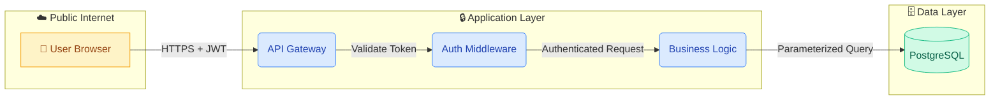

# Threat Modeling (Pipeline Phase 1)

> NIST SSDF: PW.1 — Design Software to Meet Security Requirements

**ASVS Reference:** Read `references/asvs-v1-architecture.md` before starting.

This skill executes three sequential steps: Attack Surface Mapping → Data Flow Diagram → STRIDE Analysis. Output is a single `[feature]-threat-report.md`.

---

## Step 1: Attack Surface Mapping

**Purpose:** Catalog every point where an attacker could interact with the feature.

### 1.1 Entry Point Discovery

**HTTP/API Entry Points** — For each endpoint, record:

| Field | What to capture |
|-------|-----------------|
| Route | URL pattern (e.g., `POST /api/v1/users/:id/upload`) |
| HTTP Method | GET, POST, PUT, PATCH, DELETE |
| Input Sources | Query params, path params, body, headers, cookies |
| Content-Type | JSON, multipart, XML |
| Authentication | JWT, session, API key, none |
| Authorization | Role/permission check enforced |
| Rate Limiting | Applied? Threshold? |

**WebSocket / Real-time** — Connection endpoint, message types, auth on connect.

**Background / Async** — Queue/topic names, message schema, source validation.

**File-Based** — File types accepted, size limits, storage location, content parsing.

### 1.2 External Entity Identification

| Entity Type | Examples |
|-------------|----------|
| Human Users | End users, administrators, support agents |
| External APIs | Payment gateways, email services, etc. |
| Internal Services | Other microservices the feature calls |
| Data Stores | Databases, caches, file storage, queues |
| CI/CD Systems | Build pipelines, deployment hooks |

For each entity record: Direction (Inbound/Outbound/Both), Trust Level (Trusted/Semi-Trusted/Untrusted), Protocol.

### 1.3 Trust Boundary Identification

Common boundaries:
1. Public Internet → Application Server
2. Application Server → Database
3. Application Server → External API
4. Application Server → File System
5. Frontend → Backend
6. Service → Service (verify mutual auth)
7. CI/CD → Production

For each boundary note: what crosses it, what validates it, what's missing.

### 1.4 Data Asset Inventory

| Data Asset | Classification | At Rest | In Transit | Who Can Access |
|------------|---------------|---------|------------|----------------|
| _Example_ | _Credential_ | _PostgreSQL (hashed)_ | _HTTPS POST body_ | _Auth service only_ |

---

## Step 2: Data Flow Diagram (Mermaid.js)

**Purpose:** Visualize the attack surface as a DFD with trust boundaries.

### DFD Element Mapping

| Attack Surface Element | DFD Notation | Mermaid Shape |
|------------------------|--------------|---------------|
| Human Users, External APIs, CI/CD | External Entity | `[Entity]` |
| Business logic, controllers | Process | `(Process)` |
| Databases, caches, files | Data Store | `[(Store)]` |
| Data between elements | Data Flow | `-->│label│` |
| Trust level change | Trust Boundary | `subgraph` |

### Diagram Rules
1. Use `flowchart LR` for API-centric or `flowchart TD` for layered architectures.
2. Label every arrow with the data type (e.g., `│JWT Token│`, `│SQL Query│`).
3. Use distinct styling per trust boundary subgraph.
4. Mark sensitive data flows with `:::critical` class.

### Template



### Annotate Sensitive Flows

| Flow | Sensitivity | Encrypted | Validated | Notes |
|------|-------------|-----------|-----------|-------|
| User → Gateway | Credentials/tokens | HTTPS | At gateway | Check TLS version |
| Service → DB | User input | Internal | Must be parameterized | SQL injection check |

---

## Step 3: STRIDE Analysis

**Purpose:** Apply STRIDE to every DFD element and trust boundary.

### STRIDE Reference

| Category | Threat | Security Property |
|----------|--------|-------------------|
| **S** — Spoofing | Impersonate user/service | Authentication |
| **T** — Tampering | Modify data in transit/rest | Integrity |
| **R** — Repudiation | Deny action, no evidence | Non-repudiation |
| **I** — Information Disclosure | Expose sensitive data | Confidentiality |
| **D** — Denial of Service | Exhaust resources | Availability |
| **E** — Elevation of Privilege | Gain higher access | Authorization |

### Applicability Matrix

| DFD Element | S | T | R | I | D | E |
|-------------|---|---|---|---|---|---|
| External Entity | ✅ | | ✅ | | | |
| Process | ✅ | ✅ | ✅ | ✅ | ✅ | ✅ |
| Data Store | | ✅ | | ✅ | ✅ | |
| Data Flow | | ✅ | | ✅ | ✅ | |
| Trust Boundary | ✅ | ✅ | | ✅ | | ✅ |

### Analysis per STRIDE Category

**S — Spoofing:** Check user identity spoofing (client-side IDs, token replay), service identity (mTLS, signed tokens), external entity (webhook HMAC verification).

**T — Tampering:** Check data in transit (HTTPS, schema validation, parameter manipulation), data at rest (signed cookies, integrity hashes), code/config (CI/CD, lockfiles).

**R — Repudiation:** Check audit trail coverage (CRUD logged with timestamp, actor, resource), log integrity (append-only, external), non-repudiation mechanisms (signed audit records for high-value actions).

**I — Information Disclosure:** Check API over-exposure (full objects vs DTOs), error leakage (stack traces, SQL errors), side channels (timing, enumeration), storage exposure (public S3, unprotected uploads).

**D — Denial of Service:** Check resource-intensive ops (heavy queries, file processing, unbounded pagination), rate limiting (per-user, per-IP, bypassable?), cascading failures (circuit breakers, timeouts), algorithmic complexity (regex, recursive parsing).

**E — Elevation of Privilege:** Check vertical escalation (admin endpoints, JWT role manipulation), horizontal escalation / IDOR (ownership checks per resource), input manipulation (mass assignment), token escalation (low→high privilege exchange).

### Record Each Threat

```markdown
- **Threat ID:** [S/T/R/I/D/E]-001
- **Element:** [DFD element name]
- **Description:** [What can be exploited and how]
- **Risk:** [Critical / High / Medium / Low]
- **Mitigation:** [Specific countermeasure]
```

### Risk Rating

| Level | Criteria |
|-------|----------|
| **Critical** | Remote, no auth, data breach or full compromise |
| **High** | Remote, low-priv auth, significant exposure or escalation |
| **Medium** | Specific conditions, partial exposure |
| **Low** | Complex setup, minimal disclosure |

---

## Output

Generate `outputs/[feature-name]/threat-report.md`:

```markdown
# Threat Model Report: [Feature Name]

## 1. Executive Summary
## 2. Attack Surface Map
## 3. Architecture Diagram (Mermaid.js DFD)
## 4. STRIDE Threat Matrix
## 5. Critical Findings Summary
```

**⏸ HUMAN GATE:** Present for review. Do NOT proceed to Phase 2 until approved.


## 📑 Content Map

| File | Description |
|------|-------------|
| `SKILL.md` | Main Skill Definition |
