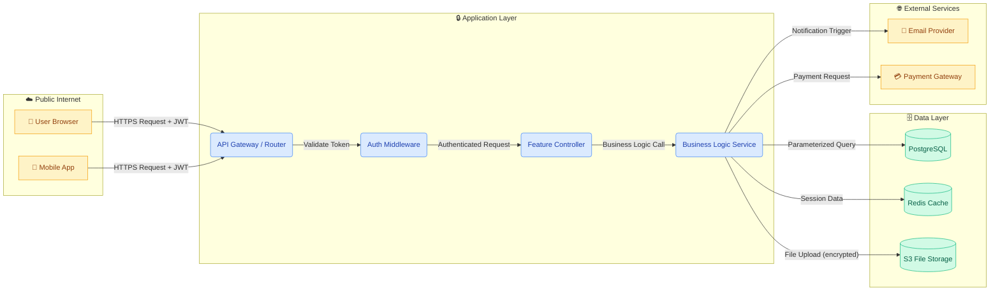

# Phase 1b: Data Flow Diagram Generation

**Purpose:** Transform the Attack Surface Map from Phase 1a into a visual Data Flow Diagram (DFD) using Mermaid.js syntax. The DFD makes trust boundaries, data flows, and potential attack paths visible at a glance.

---

## Step 1: Map Elements to DFD Notation

**Action:** Using the Attack Surface Map from `01a-attack-surface-mapping.md`, classify each element into standard DFD notation.

**DFD Element Mapping:**

| Attack Surface Element | DFD Notation | Mermaid Shape |
|---|---|---|
| Human Users, External APIs, CI/CD | **External Entity** | Rectangle `[Entity]` |
| Business logic, controllers, services | **Process** | Rounded rectangle `(Process)` |
| Databases, caches, file storage, queues | **Data Store** | Cylinder `[(Store)]` or double brackets `[[Store]]` |
| Data moving between elements | **Data Flow** | Arrow with label `-->|label|` |
| Change in trust level | **Trust Boundary** | Subgraph `subgraph BoundaryName` |

---

## Step 2: Define Trust Boundary Subgraphs

**Action:** Group elements by trust zone. Each trust zone becomes a Mermaid subgraph.

**Standard trust zones to consider:**

1. **Public Internet** — Browsers, mobile apps, external API consumers.
2. **DMZ / Edge** — Load balancers, API gateways, WAFs, reverse proxies.
3. **Application Layer** — Application servers, business logic, middleware.
4. **Data Layer** — Databases, caches, file storage.
5. **External Services** — Third-party APIs, payment gateways, email services.
6. **CI/CD & Infrastructure** — Build pipelines, container registries, secrets managers.

Only include zones that are relevant to the feature being analyzed.

---

## Step 3: Generate Mermaid.js Diagram

**Action:** Produce a complete Mermaid.js diagram following these rules:

**Diagram Rules:**
1. Use `flowchart LR` (left-to-right) for API-centric features or `flowchart TD` (top-down) for layered architectures.
2. Label every arrow with the data type being transmitted (e.g., `|JWT Token|`, `|User Input|`, `|SQL Query|`).
3. Use distinct styling for trust boundaries — different background colors per subgraph.
4. Mark data flows that carry sensitive data with a visual indicator (e.g., `:::critical` class or bold label).
5. Include a legend at the bottom of the diagram.

**Template Structure:**



---

## Step 4: Annotate Sensitive Flows

**Action:** After generating the base diagram, annotate it with security-relevant information.

**For each data flow, note in accompanying documentation:**

| Flow | Data Sensitivity | Encrypted | Validated | Notes |
|---|---|---|---|---|
| User → API Gateway | Contains credentials/tokens | Yes (HTTPS) | At gateway | Check TLS version |
| Controller → Database | Contains user input | N/A (internal) | Must be parameterized | Check for SQL injection |
| Service → S3 | Contains user files | Yes (HTTPS) | File type/size checked | Check for path traversal |

---

## Step 5: Output

**Action:** Include the Mermaid.js diagram and the annotated flow table in the `[feature]-threat-report.md` under the section **"Architecture Diagram"**.

**The diagram must be enclosed in a standard Mermaid code block:**

````markdown
## Architecture Diagram

```mermaid
[Generated Mermaid.js code from Step 3]
```

### Data Flow Annotations
[Table from Step 4]
````

**Next:** Pass this output to `01c-stride-analysis.md`, which will apply STRIDE threats to each element and flow identified in this diagram.
